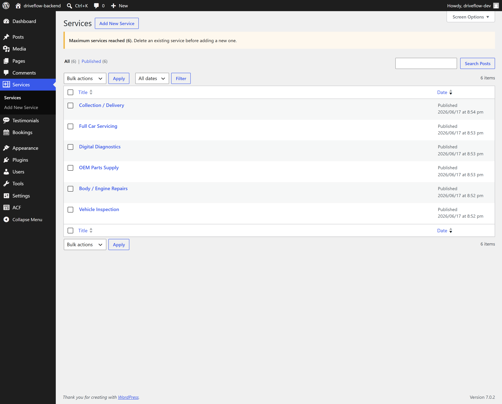

# Driveflow Backend

WordPress backend for the Driveflow project — a headless WordPress + React learning project.

## Admin Preview

Here's the backend dashboard, e.g. Services:



The Services CPT includes a custom cap (max 6 entries), enforced via the plugin with an admin notice shown once the limit is reached.

## Overview

Driveflow uses a headless WordPress architecture. WordPress is used purely as a content management system (CMS) and exposes content through the WordPress REST API for the Driveflow React frontend.

This repository contains only the custom WordPress files located inside `wp-content`. Core WordPress files are intentionally excluded from version control.

## Tech Stack

- WordPress
- PHP
- MySQL
- WordPress REST API
- JWT Authentication (for authenticated endpoints)
- Advanced Custom Fields (ACF)

## Features

- Custom `driveflow-core` plugin with a modular structure (one folder per feature)
- Custom Post Types: **Services**, **Testimonials**, **Booking**
- Custom REST API endpoints for booking creation, retrieval, updates, and deletion
- CORS handling for frontend/backend communication across separate origins
- ACF-powered content fields (bilingual EN/JP fields, select fields, etc.)
- JWT-based authentication for protected REST routes

## Repository Structure

```text
wp-content/
├── plugins/
│   ├── advanced-custom-fields/
│   ├── jwt-authentication-for-wp-rest-api/
│   └── driveflow-core/
│       ├── includes/
│       │   └── cors.php
│       ├── modules/
│       │   ├── booking/
│       │   │   ├── create-booking.php
│       │   │   ├── delete-booking.php
│       │   │   ├── read-booking.php
│       │   │   ├── register-api.php
│       │   │   └── update-booking-status.php
│       │   ├── services/
│       │   │   ├── admin.php
│       │   │   └── register-cpt.php
│       │   └── testimonials/
│       │       ├── admin.php
│       │       ├── register-cpt.php
│       │       └── rest-testimonial.php
│       └── driveflow-core.php
├── themes/
└── README.md
```

Each module under `driveflow-core/modules/` is self-contained: it registers its own CPT and, where needed, its own REST endpoints and admin logic. `includes/cors.php` handles cross-origin requests so the React frontend (running on a different local port/domain) can talk to the API.

## Local Development

### Requirements

- [LocalWP](https://localwp.com/)
- PHP
- MySQL

### Setup

1. Create a new WordPress site in LocalWP (e.g. `driveflow-backend.local`).
2. Copy the contents of this repository into the site's `wp-content` directory.
3. Start the site.
4. In WP Admin, install/activate:
   - **Advanced Custom Fields**
   - **JWT Authentication for WP REST API**
   - **Driveflow Core** (the custom plugin in this repo)
5. Confirm CPTs (Services, Testimonials, Booking) appear in the WP Admin sidebar.

## API

Example endpoints:

```text
GET  /wp-json/wp/v2/services
GET  /wp-json/wp/v2/testimonials
GET  /wp-json/driveflow/v1/bookings
POST /wp-json/driveflow/v1/bookings
```

> Booking endpoints are registered separately from the default `wp/v2` namespace via `register-api.php`, since bookings require custom create/read/update/delete logic beyond a standard CPT.

The Driveflow React frontend consumes data from these endpoints.

## Learning Goals

This project was built to practice:

- Custom Post Types and REST API exposure
- Building custom REST endpoints beyond default CPT routes
- JWT authentication in a headless WordPress setup
- CORS handling between separate frontend/backend origins
- ACF field integration with a React frontend
- Modular WordPress plugin architecture
